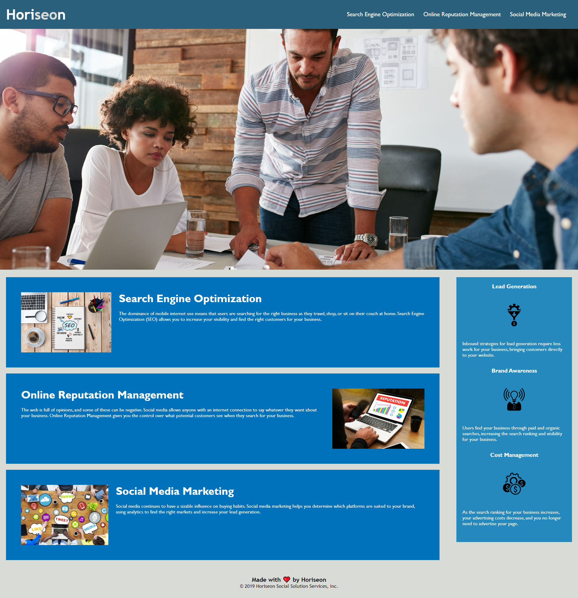

HTML CSS Git Challenge: Code Refactor

For this challenge I was provided with existing code and tasked to enhance the page’s accessibility and refactor the code to enhance the readability, eliminate redundancy, and ensure that best practices are followed. The challenge also included setting up a GitHub repository for the project, following best practices, and ensuring the result could be viewed via a public URL. 

Link to the final page:
https://jdlawton.github.io/horiseon-social-solution-services/

